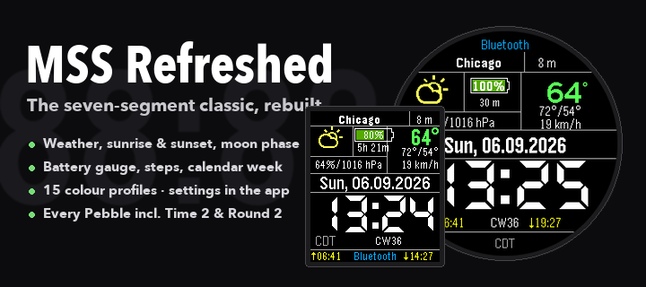
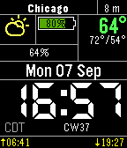
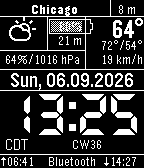
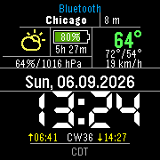
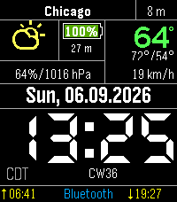
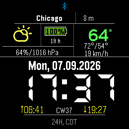
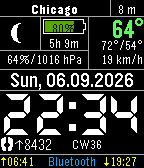

# MSS Refreshed

A highly configurable, information-rich Seven Segment watchface for Pebble Time, Pebble Time Round, Pebble 2, Pebble Time 2 and Pebble Round 2. Legacy `aplite` devices are no longer targeted.

**Original watchface:** [Multifunctional 7 Segment (MSS7)](https://apps.rebble.io/en_US/application/5569c2084bebd0b90400000e) by FG — all credit for the design goes to the original.
**Updated for the new watches by:** Henry Miller, a fan of the original, with AI assistance (I don't program — I just wanted the face I love to work on Pebble Time 2 and Round 2).



## Download

Grab the latest `.pbw` from the **[Releases page](https://github.com/amethus1/MMS7-Pebble/releases/latest)**:

- `MSS-Refreshed-<version>.pbw` — for watches on current PebbleOS (4.32 or newer).
- `MSS-Refreshed-<version>-sdk4.9.pbw` — the same face built with SDK 4.9, for watches still on older firmware.

Open the file on your phone and it will install through the Pebble app. Works on Pebble Time / Time Steel, Time Round, Pebble 2, Pebble Time 2 and Pebble Round 2.

## Screenshots

| Pebble Time (Basalt) | Pebble 2 (Diorite) | Pebble Time Round (Chalk) |
| :---: | :---: | :---: |
|  |  |  |
| **Pebble Time 2 (Emery)** | **Pebble Round 2 (Gabbro)** | **Night / Health Mode** |
|  |  |  |

## Overview

This project is a modernize and refactored version of the classic MSS watchface. It retains the distinct seven-segment aesthetic while significantly improving code quality, configuration, and feature set.

## New Features & Improvements

### 🔧 Modern Configuration (Clay)
- **Built-in Settings:** No longer relies on external websites. All settings are built directly into the Pebble app using `@rebble/clay` (the maintained fork of `pebble-clay`).
- **Instant Updates:** Settings apply immediately upon save.

### 📅 Fiscal Week Support
- **Customizable Start:** Define your fiscal year start month and day.
- **Display Options:** Choose between ISO Calendar Week (`CW`) or Fiscal Week (`WK`).
- **Integration:** Fiscal week number can be appended to the date line or shown in the weather info area.

### 🎨 Customization
- **Visibility Toggles:** Option to hide the Calendar Week and Bluetooth connection label for a cleaner look.
- **Health Info:** Toggle between showing Timezone name, Steps, Sleep, or Auto-switch (Steps day / Sleep night) in the bottom-left corner.
- **Timezone:** Flexible display formats (UTC, TZ Name, AM/PM + TZ).
- **Unit Support:** Speed (km/h, mph, m/s) and Pressure (hPa, mmHg, inHg).

### 🛠 Technical Refactoring
- **Unified Codebase:** Merged split source files into a unified, maintainable C structure.
- **Optimization:** Significant RAM reduction (~5KB saved) and storage optimization (-45% size) by removing unused assets.
- **Stability:** Robust settings parsing prevents invalid configurations (e.g., "Color Cycling" bugs).
- **Fixes:** Resolved layout issues, font memory leaks, and buffer overflows.

## Build Instructions

This project uses the standard Pebble SDK.

```bash
# Build the project
pebble build

# Install to phone/watch
pebble install
```

## Credits

- Based on **Multifunctional 7 Segment** by **FG** — the original design and the idea are theirs.
- Updated for Pebble Time 2 / Round 2 and refreshed by **Henry Miller** with AI assistance.
- Weather data provided by Open-Meteo.
